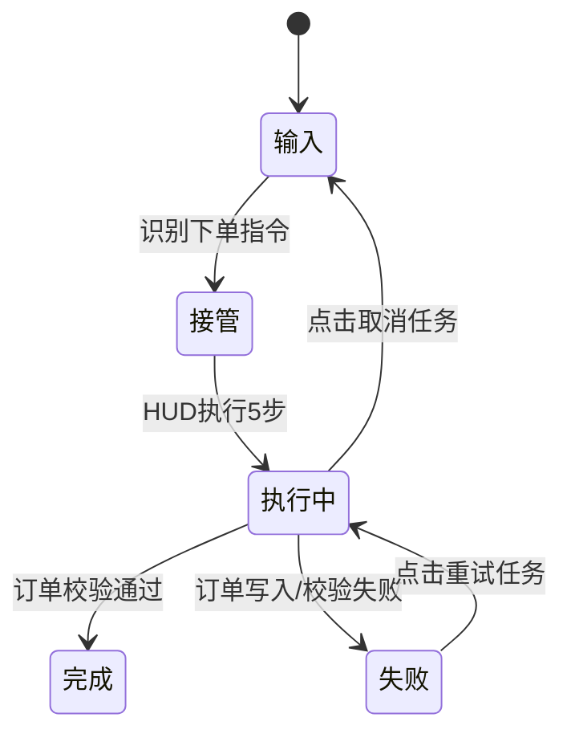

# AI 助手商城智能下单交互稿（低保真）

## 1. 状态流转图

## 2. 关键状态线框
1. 输入：聊天面板，用户输入“帮我买主粮”。
2. 接管：关闭聊天面板，显示 HUD 标题“执行商城智能下单”。
3. 执行中：5步状态逐条点亮（解析需求/进入商城/选择商品/提交下单/结果校验）。
4. 失败：HUD 状态红色，按钮显示“重试任务/关闭”。
5. 完成：HUD 显示“已完成：已创建商城订单”，按钮显示“完成/打开助手”。

## 3. 关键文案规范
1. 任务标题：`执行商城智能下单`
2. 成功文案：`已完成：已创建商城订单`
3. 失败文案：`执行失败：{错误原因}`
4. 取消文案：`任务已取消`

## 4. 评审清单
1. 下单指令是否可被稳定识别。
2. HUD 五步是否与真实执行一致。
3. 失败/重试/取消是否闭环。
4. 是否存在误触发论坛任务的冲突。
