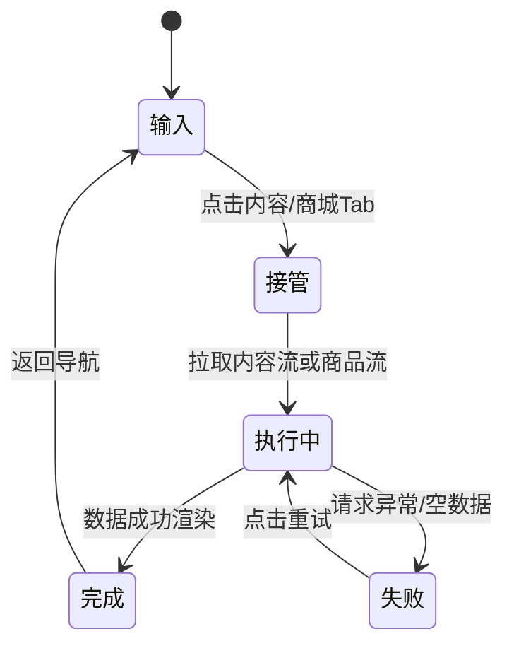

# 内容合并 + 商城 MVP 交互稿（低保真）

## 1. 状态流转图

## 2. 关键状态线框

### 状态A：输入（底部导航）
- 底部 5 项：探索 / 论坛 / 内容 / 商城 / 我的
- 未激活状态低对比，激活状态高亮

### 状态B：接管（内容页加载）
- 顶部：`内容中心`
- 分区：`百科精选`、`幸福故事`
- 每区显示 2~4 条卡片 + `查看更多`

### 状态C：执行中（商城拉取中）
- 顶部：`宠物用品商城`
- 分类 chips 占位
- 商品骨架屏
- 事件日志区域显示：`fetch_products: running`

### 状态D：失败（商城拉取失败）
- 错误说明：`加载失败，请检查网络后重试`
- 按钮：`重试`
- 事件日志：`fetch_products: failed`

### 状态E：完成（商城列表渲染）
- 商品卡片：图/标题/价格/评分/标签
- 按钮：`查看详情`
- 事件日志：`fetch_products: success`

## 3. 关键文案规范
1. 内容 Tab 标题：`内容中心`
2. 商城页标题：`宠物用品商城`
3. 失败提示：`网络开小差了，点击重试继续逛`
4. 下单按钮：`去下单`
5. 空态文案：`暂无商品，稍后再来看看`

## 4. 评审清单
1. 底部导航是否保持 5 项，信息层级是否清晰。
2. 内容页是否能明显感知“百科+故事”已合并。
3. 商城是否满足最小可逛（分类、列表、详情）。
4. 失败态与重试链路是否完整。
5. 埋点点位是否覆盖关键漏斗。
