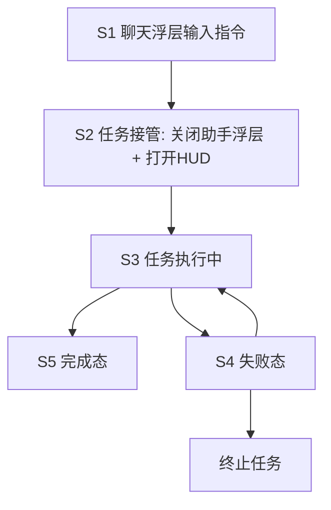

# Forum Agent Task HUD 交互稿（低保真）

## 1. 场景目标

用户一句话触发论坛多步操作：
`帮我给第一个帖子点赞评论123`

系统自动完成：
1. 解析目标帖子
2. 进入详情
3. 点赞
4. 评论
5. 校验结果

并通过底部任务 HUD 实时展示进展。

---

## 2. 全局状态流



---

## 3. 关键交互稿

## S1 聊天浮层（执行前）

```
┌─────────────────────────────────────┐
│ 🐕 宠物小助手                    ✕  │
├─────────────────────────────────────┤
│ 用户：帮我给第一个帖子点赞评论123      │
│                                     │
│ [发送]                              │
└─────────────────────────────────────┘
```

说明：
1. 用户发出执行型指令
2. 助手识别为“任务模式”

---

## S2 任务接管（切换态）

```
(助手浮层关闭)

┌─────────────────────────────────────┐
│ 论坛页面（可见）                     │
│ ...                                 │
└─────────────────────────────────────┘

        ┌─────────────────────────┐
        │ 正在执行你的任务...      │
        │ 准备步骤 1/5             │
        └─────────────────────────┘
```

说明：
1. 聊天大浮层收起，避免遮挡
2. 底部出现任务 HUD（可折叠）

---

## S3 执行中（HUD 展开）

```
┌─────────────────────────────────────┐
│ 论坛页面（详情页）                   │
│ ...                                 │
└─────────────────────────────────────┘

┌─────────────────────────────────────┐
│ 执行论坛互动                    _    │
│ 2/5 进入帖子详情中...               │
│                                     │
│ ✓ 1. 解析目标帖子（第1个）           │
│ ⟳ 2. 进入帖子详情                   │
│ • 3. 点赞                           │
│ • 4. 评论“123”                      │
│ • 5. 校验结果                       │
│                                     │
│ [取消任务]                 [收起]   │
└─────────────────────────────────────┘
```

说明：
1. 实时步骤状态：`待执行/执行中/成功`
2. 每步可显示 detail（如帖子标题）

---

## S4 失败态（可恢复）

```
┌─────────────────────────────────────┐
│ 执行论坛互动（失败）                 │
│ 4/5 评论失败：confirm token 过期     │
│                                     │
│ ✓ 1. 解析目标帖子                    │
│ ✓ 2. 进入帖子详情                    │
│ ✓ 3. 点赞                            │
│ ✕ 4. 评论“123”                       │
│ • 5. 校验结果                        │
│                                     │
│ [重试该步] [终止任务] [查看日志]      │
└─────────────────────────────────────┘
```

说明：
1. 失败步骤必须可重试
2. 错误文案可读，不暴露底层术语

---

## S5 完成态（可回看）

```
┌─────────────────────────────────────┐
│ 执行论坛互动（已完成）               │
│ 已完成：点赞 + 评论“123”             │
│                                     │
│ ✓ 1. 解析目标帖子                    │
│ ✓ 2. 进入帖子详情                    │
│ ✓ 3. 点赞                            │
│ ✓ 4. 评论“123”                       │
│ ✓ 5. 校验结果                        │
│                                     │
│ [查看结果] [再次执行] [关闭]          │
└─────────────────────────────────────┘
```

说明：
1. 提供明确成功反馈
2. 可一键定位到执行结果（最新评论）

---

## 4. HUD 折叠态

```
┌─────────────────────────────────────┐
│ ✅ 已完成：点赞 + 评论“123”   [展开] │
└─────────────────────────────────────┘
```

说明：
1. 完成后默认折叠，减少打扰
2. 仍保留“可追溯入口”

---

## 5. 文案规范（建议）

1. 进行中：
   - `正在解析目标帖子...`
   - `正在进入帖子详情...`
2. 成功：
   - `已完成点赞`
   - `已发布评论“123”`
3. 失败：
   - `评论发布失败，请重试`
   - `未找到第一个帖子，请刷新列表后重试`

---

## 6. 评审清单

1. 切换时机是否自然（发送后 300ms 内接管）
2. HUD 是否遮挡关键操作区域
3. 失败恢复入口是否明确
4. 完成态是否支持结果回看
5. 文案是否“动作化、可理解、可追溯”

---

## 7. 下一步（高保真）

1. 将本稿导入 Figma，产出移动端高保真（iPhone 390x844）
2. 增加微动效标注（步骤切换、成功勾选、折叠过渡）
3. 与技术状态机字段一一映射（status/step/detail/actions）

