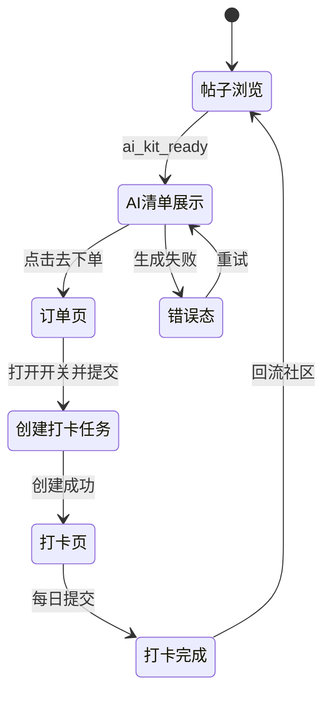

# 社区驱动商城闭环 - 低保真交互稿

## 1. 状态流转图

## 2. 关键状态线框
1. 帖子页状态
- 内容下方卡片：`AI提炼用品清单`
- 每项含：商品图、名称、理由、证据摘录、按钮

2. 订单页状态
- 商品摘要
- 地址维护区
- `加入7天打卡任务` 开关（默认开）

3. 打卡页状态
- Day 1~Day 7 进度条
- 今日任务卡片
- 打卡按钮（可附一句记录）

4. 失败状态
- 清单失败：重试
- 任务失败：稍后创建/返回
- 打卡失败：重试并保留输入

5. 完成状态
- 展示“已连续打卡 N 天”
- 按钮：`回到原帖分享进展`

## 3. 关键文案规范
1. 清单标题：`AI提炼用品清单`
2. 推荐理由前缀：`为什么推荐：`
3. 证据前缀：`来自帖子：`
4. 任务开关文案：`加入7天打卡计划`
5. 完成文案：`你已经完成今天打卡，明天继续加油`

## 4. 评审清单
1. 社区到商城入口是否自然。
2. 推荐理由与证据是否增强信任。
3. 下单到打卡路径是否顺畅。
4. 回流入口是否明确。
