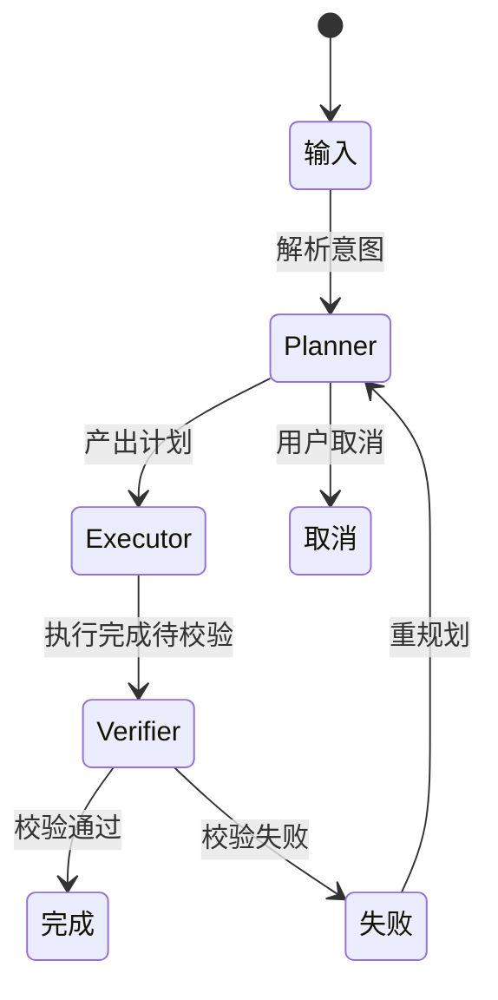

# 多Agent协同执行轨迹 - 低保真交互稿

## 1. 状态流转图

## 2. 关键状态线框
1. 输入：用户输入任务，点击执行。
2. 执行中：三代理卡片按时间线滚动更新。
3. 失败：Verifier 卡片标红并给出重试建议。
4. 重试中：Planner 生成 plan_v2，Executor 继续。
5. 完成：显示最终结果与证据链接。

## 3. 关键文案规范
1. Planner：`正在拆解任务并生成执行计划...`
2. Executor：`正在调用工具执行第 {n} 步...`
3. Verifier：`正在核验结果与证据一致性...`
4. 失败提示：`校验失败，已生成重试策略`。

## 4. 评审清单
1. 三代理职责是否清晰。
2. 轨迹是否满足对外讲解。
3. 失败恢复是否闭环。
4. 证据展示是否可追溯。
