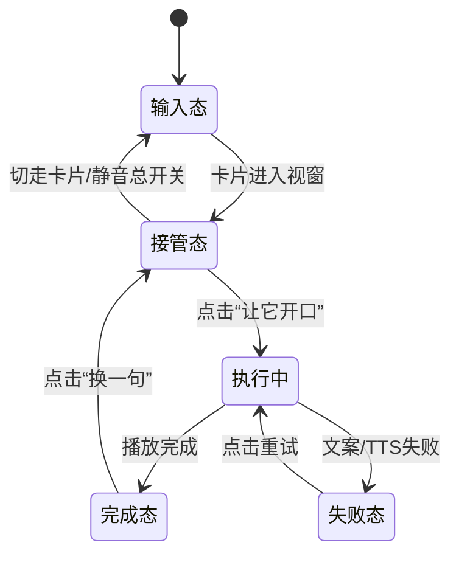

# 宠物会说话卡片（低保真交互稿）

## 1. 状态流转图

## 2. 关键状态线框
### A. 输入态（初始卡片）
- 区块：宠物图片、基本信息、静态操作（收藏/申请）
- 文案：`这只修狗还没开口，点一下试试？`
- CTA：`让它开口`

### B. 接管态（AI 气泡出现）
- 区块：头像角标 `AI`
- 气泡：短梗首句（12-24 字）
- CTA：`播放语音`、`换一句`

### C. 执行中（播放中）
- 区块：声波动画、进度条、同步字幕
- CTA：`暂停`、`静音全部`
- 提示：`内容基于宠物真实档案生成`

### D. 失败态
- 文案：`它刚刚嘴瓢了，再给一次机会？`
- CTA：`重试`、`仅看文字`
- 降级：显示安全模板句

### E. 完成态
- 文案：`说完啦，你要不要带我回家？`
- CTA：`收藏`、`申请领养`、`换一句`

## 3. 关键文案规范
- 人设：嘴贫、轻松、有梗，但不攻击用户
- 长度：
  - 气泡首句 12-24 字
  - 主播报 40-90 字
- 禁止：歧视、低俗、医疗承诺、价格误导、虚假履历
- 必须：可追溯到 pet_profile 字段（年龄/性格/亲人度/健康状态）

## 4. 评审清单
- 是否 3 秒内理解“这是 AI 会说话卡片”
- 是否可一键关闭声音，避免打扰
- 失败态是否可恢复且不阻断主链路
- 梗内容是否“好笑但不越界”
- 是否自然引导到收藏/申请动作
