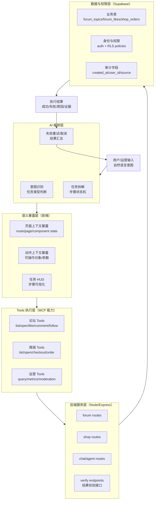
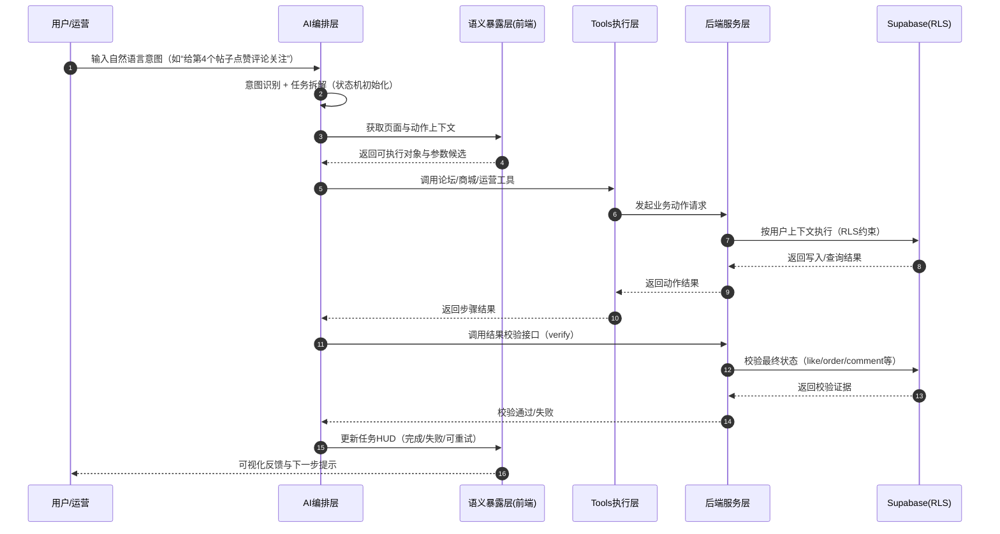

# AI MCP 技术架构总览（软件工程版）

## 1. 架构目标
围绕“从用户意图到可验证结果”的闭环，我们将系统拆为五层：
1. AI 编排层
2. 语义暴露层
3. Tools 执行层
4. 后端服务层
5. 数据与权限层（Supabase + RLS）

该架构的核心价值是：
1. 可执行：AI 不止生成文本，而是可调用业务能力。
2. 可验证：每个步骤都有状态与结果校验。
3. 可治理：权限、动作边界、审计链路清晰。

## 2. 分层架构图

## 3. 端到端执行流程图（意图 -> 结果）

## 4. 工程约束与生产要求映射
1. 准确性：通过“语义暴露 + 工具白名单”替代视觉猜测点击。
2. 性能：工具直连业务路由，减少多模态反复推理开销。
3. 稳定性：状态机驱动，支持重试、取消、超时控制。
4. 安全性：RLS 权限边界 + 服务端参数校验。
5. 可观测性：步骤状态、错误原因、校验结果可追踪。

## 5. 与当前项目能力映射
1. 论坛：`/forum` 相关路由已支持点赞、评论、关注与校验链路。
2. 商城：`/shop` 与 `shop_orders` 支持智能下单意图与订单流程承接。
3. AI 助手：任务 HUD 提供步骤状态可视化、失败重试与取消能力。
4. 权限：Supabase RLS 提供数据访问控制基线。

## 6. 后续可扩展方向
1. 引入统一任务编排协议（Task/Step Event Schema）用于多场景复用。
2. 增加工具调用熔断与降级策略（例如 fallback 到只读建议模式）。
3. 打通自动化回归：复用同一状态机做执行与断言。
