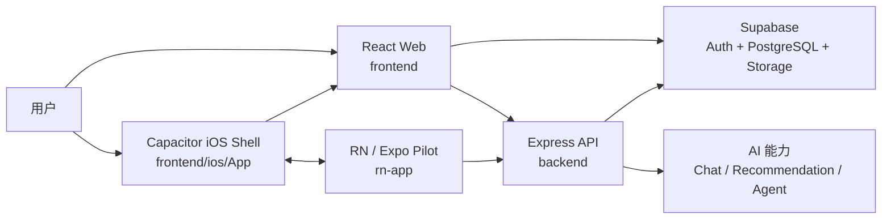

# Dog Project 技术架构总览

## 1. 系统定位

Dog Project 是一个宠物领养与宠物社区平台。核心用户体验是移动优先的宠物浏览、
收藏、领养申请、论坛互动、内容阅读、商城与 AI 助手。

当前仓库采用多客户端、统一业务后端的架构:

- `frontend`: 主产品客户端, React Web 应用, 同时作为 Capacitor iOS App 的主要 UI。
- `frontend/ios/App`: Capacitor 生成并维护的原生 iOS 工程。
- `rn-app`: React Native/Expo 试点模块, 当前承载宠物详情和论坛详情的原生化探索。
- `backend`: Express API 服务, 可本地运行或部署到 Vercel。
- `Supabase`: PostgreSQL、认证和存储基础设施。

## 2. 总体架构



## 3. 客户端架构

### 3.1 React 主应用

技术栈:

- React 19 + Vite 7
- React Router 7
- TanStack Query
- React Context
- Tailwind CSS + Framer Motion
- Capacitor 8

应用入口位于 `frontend/src/main.jsx` 和 `frontend/src/App.jsx`。

`App.jsx` 的主要职责:

- 装配 `AuthProvider`、`QueryClientProvider`、`DogProvider`、`TaskProvider`、
  `ForumListProvider`。
- 定义公开、登录后和权限控制路由。
- 保持首页、论坛、商城、内容、故事和个人中心等主 Tab 常驻挂载。
- 为 iOS WebView 提供左边缘返回手势。
- 全局挂载聊天助手和调试浮层。

主要业务域:

| 业务域 | 前端位置 |
|---|---|
| 认证与用户资料 | `context/AuthContext.jsx`, `pages/Login.jsx`, `pages/Profile.jsx` |
| 宠物浏览与收藏 | `context/DogContext.jsx`, `pages/Home.jsx`, `pages/PetDetails.jsx` |
| 领养申请与审核 | `pages/Application.jsx`, `pages/Admin.jsx` |
| 论坛社区 | `pages/Forum*.jsx`, `context/ForumListContext.jsx` |
| 故事与百科 | `pages/Stories*.jsx`, `pages/Wiki*.jsx` |
| 商城与挑战 | `pages/Shop*.jsx`, `pages/ChallengeCheckin.jsx` |
| AI 对话与推荐 | `components/ChatAssistant.jsx`, `hooks/useChat*.js` |
| 权限管理 | `components/PermissionRoute.jsx`, `constants/permissions.js` |

### 3.2 Capacitor iOS 容器

`frontend/capacitor.config.json` 定义:

- App ID: `com.wenson.dogadopt`
- App 名称: `汪星球领养`
- Web 产物目录: `dist`

发布链路:

```text
React/Vite source
  -> vite build
  -> frontend/dist
  -> cap sync/copy ios
  -> frontend/ios/App/App/public
  -> Xcode build
  -> App.app
```

iOS 工程通过 CocoaPods 集成 Capacitor 插件、React Native 和 Expo 依赖。必须打开
`frontend/ios/App/App.xcworkspace`, 不能只打开 `.xcodeproj`。

### 3.3 React Native / Expo 试点层

`rn-app` 不是独立的主 App, 而是被同一个 iOS 工程通过 Podfile 嵌入的原生化试点。

当前试点页面:

- `PetDetailsScreen`
- `ForumDetailScreen`

Web 与 RN 之间使用 `dogproject://` Deep Link 协议传递路由和认证信息:

```text
dogproject://pet/<petId>
dogproject://forum/<topicId>
dogproject://close
```

`frontend/src/utils/rnDeepLink.js` 负责从 Web 构造 Deep Link。它优先通过短期 mobile
ticket 传递认证状态, 失败时回退到 token/userId 参数。

`rn-app/src/navigation/linking.js` 负责解析 Deep Link。`rn-app/App.js` 根据解析结果切换
宠物详情或论坛详情, 并持久化认证状态。

## 4. 后端架构

后端使用 Express, 入口为:

- 本地服务: `backend/index.js`
- 应用装配: `backend/app.js`
- Vercel Serverless: `backend/api/index.js`

代码按 Route -> Controller -> Service/Utils -> Supabase 分层:

```text
HTTP Request
  -> routes/*
  -> middleware/*
  -> controllers/*
  -> services/* / utils/*
  -> Supabase
```

`backend/app.js` 同时挂载 `/xxx` 和 `/api/xxx`, 用于兼容本地开发与不同部署环境。
非关键的 `agent` 和 `health` 路由采用延迟加载, 避免可选模块初始化失败拖垮整个 API。

主要 API 域:

| API 域 | 路由 |
|---|---|
| 认证 | `/auth` |
| 宠物与收藏 | `/dogs`, `/favorites` |
| 领养流程 | `/applications`, `/dog-submissions` |
| 消息与评论 | `/messages`, `/reviews` |
| 社区内容 | `/forum`, `/stories`, `/wiki` |
| AI 与推荐 | `/chat`, `/recommendations`, `/agent` |
| 商城与活动 | `/shop`, `/challenge` |
| 权限与运营 | `/permissions`, `/stats`, `/upload` |

## 5. 数据与认证

### 5.1 Supabase 职责

Supabase 提供:

- PostgreSQL 业务数据
- Supabase Auth 用户会话
- Storage 文件上传与公开 URL
- RLS 和服务端 Service Role 权限

核心 schema 位于 `sql/supabase_schema.sql`, 论坛 schema 位于 `sql/forum_schema.sql`,
增量变更位于 `backend/migrations/` 和 `sql/`。

核心数据域:

- 用户: `profiles`
- 宠物: `dogs`
- 收藏: `favorites`
- 领养: `applications`, `dog_submissions`
- 消息: `messages`
- 社区: `forum_topics`, `forum_comments`, `forum_replies`, likes/follows
- 商城: `shop_orders`

### 5.2 双通道访问

前端既会直接使用 Supabase 客户端处理认证和存储, 也会调用 Express API 完成业务操作。

- 前端 Supabase: 使用 `VITE_SUPABASE_URL` 和 `VITE_SUPABASE_ANON_KEY`。
- 后端 Supabase: 优先使用 `SUPABASE_SERVICE_ROLE_KEY`, 执行管理和服务端业务。
- API 地址: 开发环境默认 `http://localhost:5001/api`, 生产默认
  `https://dog-project-6aoq.vercel.app/api`, 可用 `VITE_API_URL` 覆盖。

## 6. 权限与安全边界

权限控制分为三层:

1. 页面层: `PrivateRoute` 和 `PermissionRoute` 控制前端导航。
2. API 层: Express middleware 和 permissions routes 控制服务端操作。
3. 数据层: Supabase Auth、RLS 与 Service Role 控制数据库访问。

前端页面权限只用于用户体验, 不能替代 API 和数据库层校验。

移动端认证桥接优先使用一次性 mobile ticket, 避免长期 token 直接暴露在 Deep Link 中。

## 7. 核心运行链路

### 7.1 Web 本地开发

```text
pnpm dev
  -> Vite localhost:5173
  -> Express localhost:5001/api
  -> Supabase
```

### 7.2 iOS 真机

```text
Vite build
  -> Capacitor sync ios
  -> CocoaPods / RN codegen
  -> xcodebuild
  -> devicectl / cap run
  -> iPhone
```

详细步骤见 `docs/IOS_CODEX_QUICKSTART.md`。

### 7.3 生产部署

- 前端: Vercel 静态站点。
- 后端: Vercel Serverless Express。
- 数据与认证: Supabase 托管服务。
- iOS: Xcode 构建、签名和安装/发布。

## 8. 当前架构特点与注意事项

### 优点

- Web、iOS 和 RN 试点共享同一业务后端与数据模型。
- 主产品继续快速使用 React Web 迭代, 同时允许逐页探索 RN 原生化。
- Express 路由按业务域拆分, 支持本地和 Vercel 两种运行环境。
- Supabase 降低认证、数据库和存储的基础设施成本。

### 注意事项

- iOS Podfile 同时依赖 `frontend/node_modules` 和 `rn-app/node_modules`, 两边依赖必须齐全。
- Capacitor clean 可能删除 RN codegen 产物, 真机构建前需要重新生成。
- Web 直接访问 Supabase 与后端 Service Role 访问并存, 新功能必须明确数据访问边界。
- `sql/`、`backend/migrations/` 和历史 schema 并存, 数据库变更需要同步维护。
- RN 当前是试点层, Deep Link 协议是 Web/RN 集成的关键契约。

## 9. 关键文档

- `docs/IOS_CODEX_QUICKSTART.md`: iOS 同步、构建和真机启动。
- `docs/BACKEND_LOGIC.md`: 后端业务流程。
- `docs/DEPLOYMENT.md`: Web/Vercel 部署。
- `docs/MOBILE_DEPLOYMENT.md`: 移动端部署。
- `sql/supabase_schema.sql`: 核心数据库 schema。
