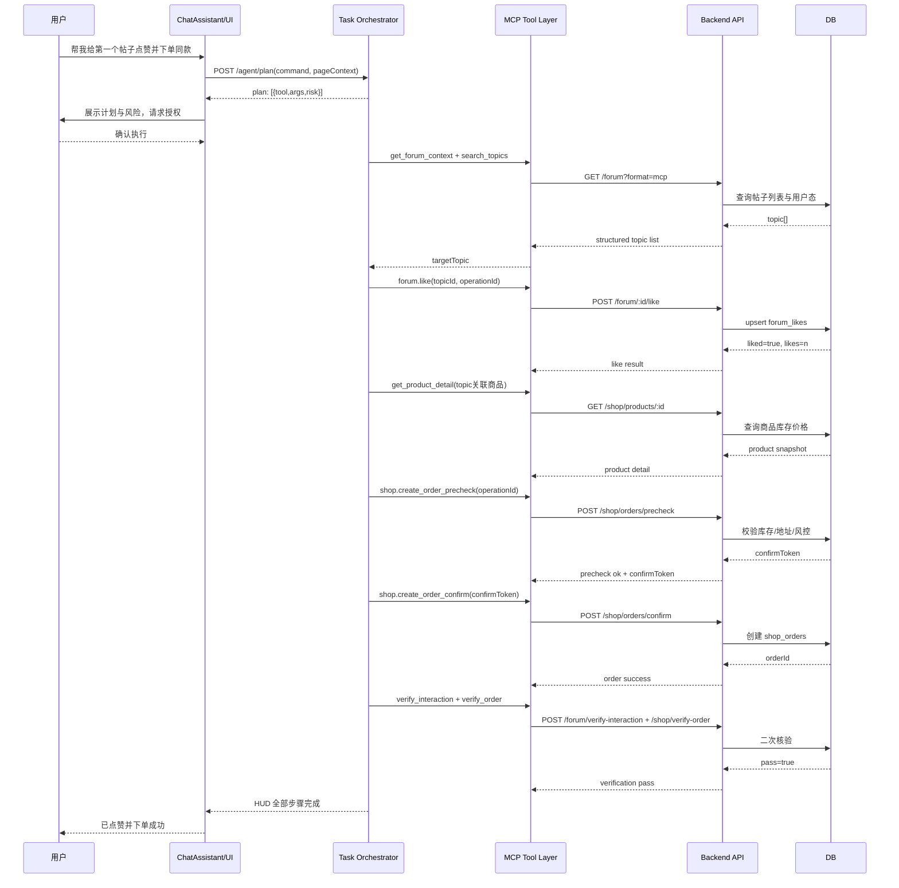

# 智能点赞下单架构图（Web MCP）

## 1. 目标
围绕“帮我给第一个帖子点赞并下单同款”这类复合意图，建立可执行、可校验、可回放的智能操控链路，重点突出：
1. 数据如何安全暴露给 AI（MCP Tools）
2. 操作如何被编排、执行、回写与校验（Task Orchestrator）

## 2. 总体架构图（数据暴露 + 操作执行）

```mermaid
flowchart LR
  U[用户输入自然语言指令] --> A[ChatAssistant 前端]
  A --> B[LLM Agent Planner\n/agent/plan 产出工具计划]
  B --> C[Allowlist Tool Executor\n步骤状态机]
  C --> X[Authorization Gate\n用户确认后执行]

  subgraph D[数据暴露层 Data Exposure]
    D1[get_forum_context]
    D2[search_topics]
    D3[get_topic_detail]
    D4[get_shop_catalog]
    D5[get_product_detail]
    D6[get_user_profile\n权限上下文]
  end

  subgraph E[操作执行层 Action Execution]
    E1[forum.like]
    E2[forum.comment]
    E3[forum.follow_author]
    E4[shop.create_order_precheck]
    E5[shop.create_order_confirm]
    E6[verify_interaction]
    E7[verify_order]
  end

  X --> D
  X --> E

  subgraph F[后端 API + 领域服务]
    F1[Forum Controller]
    F2[Shop Controller]
    F3[Order Service\n幂等与风控]
    F4[Auth/RLS Guard]
  end

  D --> F
  E --> F

  subgraph G[(Supabase/Postgres)]
    G1[forum_topics]
    G2[forum_likes]
    G3[forum_comments]
    G4[shop_products]
    G5[shop_orders]
    G6[assistant_action_logs]
  end

  F --> G
  C --> H[Task HUD\n步骤可视化]
  C --> I[Action Log\n审计/回放]
  I --> G6

  H --> J[详情页局部刷新\nTaskContext syncKey]
```

## 3. 核心原理

### 3.1 数据暴露原理（Data Exposure）
1. **按需暴露**：只暴露当前任务需要的最小工具集，降低 token 和误调用风险。  
2. **语义化返回**：MCP 返回结构化字段（`topicId`、`liked`、`price`、`stock`），而不是让模型猜 DOM。  
3. **权限前置**：每个读取工具携带 `userId`，在后端通过 RLS/鉴权过滤可见数据。  
4. **上下文聚合**：`get_forum_context` / `get_shop_catalog` 做聚合返回，减少多次往返。

### 3.2 操作执行原理（Action Execution）
1. **状态机驱动**：`pending -> running -> ok/failed/skipped`，每步可见、可取消、可重试。  
2. **两阶段提交**：高风险动作（下单/发布）走 `precheck -> confirm`。  
3. **幂等保障**：所有写操作带 `operationId`，服务端去重，避免重复点赞/重复下单。  
4. **结果校验**：最后必须走 `verify_interaction` + `verify_order`，不是只看接口 200。  
5. **回流刷新**：执行成功后写 `taskContext.syncKey`，详情页监听并主动拉新状态。

## 4. 端到端时序图（点赞 + 下单）



## 5. Tool 契约建议（最小集）

Planner 输出的 tool name 必须在 allowlist 内, 前端执行器按 tool 分发:

1. `forum.search_topics(args)` -> `{ items }`
2. `forum.resolve_topic(args)` -> `{ topicId,title }`
3. `forum.like_topic(topicId,userId,authorizationId)` -> `{ liked, likes }`
4. `forum.comment_topic(topicId,content,userId,authorizationId)` -> `precheck/reply -> confirm/reply`
5. `forum.follow_author(topicId,userId,authorizationId)` -> `{ followed }`
6. `forum.verify_interaction(topicId,userId)` -> `{ pass, evidence }`
7. `shop.select_product(productId|productQuery, quantity)` -> `{ productId, quantity, quote }`
8. `shop.open_checkout(productId, quantity, authorizationId)` -> 进入订单页; 真正创建订单仍由订单页二次确认。

## 6. 失败与降级策略
1. MCP 工具不可用：降级为“仅给出操作建议，不自动执行”。
2. precheck 失败：HUD 停在失败步骤并给出可恢复动作（改商品、改数量、补地址）。
3. confirm 超时：可重放 confirm（依赖 confirmToken TTL 与幂等）。
4. 校验失败：标记 `inconsistent`，触发二次拉取与人工确认。

## 7. 实施检查清单
1. 前端：Task HUD 步骤扩展到“点赞+下单”复合流。
2. 前端：TaskContext 增加 `operationId`、`syncKey`、`orderId`。
3. 后端：新增订单 precheck/confirm/verify 接口与幂等键校验。
4. 数据库：补 `assistant_action_logs`、`idempotency_keys`（或等效表）。
5. 监控：记录步骤耗时、失败率、重试率、最终成功率。
